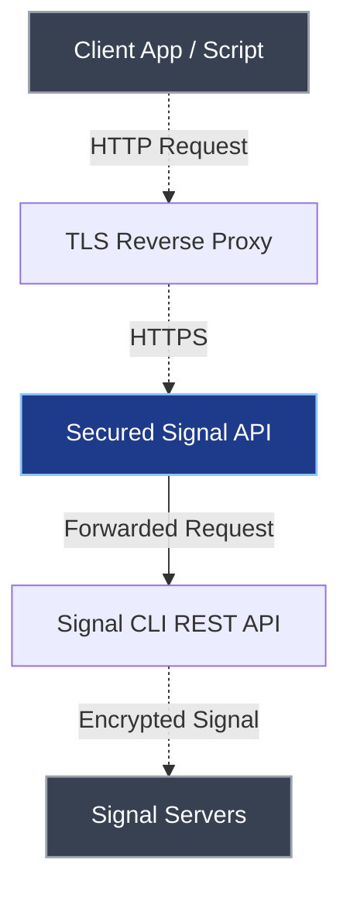

# About

**Secured Signal API** is a secure, configurable proxy for [Signal CLI REST API](https://github.com/bbernhard/signal-cli-rest-api).  
It does **not** replace or modify the original API — it sits in front of it, adding a layer of control, authentication, and flexibility for production use.

## What it Is

The [Signal CLI REST API](https://github.com/bbernhard/signal-cli-rest-api) provides a robust HTTP interface to the Signal Messenger service.  
**Secured Signal API** works as a **reverse proxy**, forwarding approved requests to your existing Signal CLI REST API instance, while managing access and configuration.

It's designed for developers who want to:

- **Restrict** or **log** certain API calls
- Enforce **authentication**
- Add **templating** or **request preprocessing**
- And deploy everything neatly via **Docker**

## Key Features

- 🔒 **Access Control** — Protect your Signal API with [**token-based authentication**](./usage#auth) and [**endpoint restrictions**](./features#endpoints)
- ⏱️ **Rate Limiting** — [**Limit requests**](./features#rate-limiting) per token to prevent server overload and abuse
- 🧩 **Full Compatibility** — 100% protocol-compatible; all requests are still handled by your existing Signal CLI REST API
- ⚙️ **Configurable Proxy Behavior** — Define templates and limits via YAML or environment variables
- 🧠 **Message Templates** — Use [**variables**](./configuration/variables) and [**placeholders**](./features#placeholders) to standardize common message formats
- 🐳 **Docker-Ready** — Comes packaged for containerized environments, deployable in seconds
- [And much more…](./features)

## Architecture

Secured Signal API acts purely as a **gateway** — it never bypasses or replaces your existing Signal CLI REST API:

